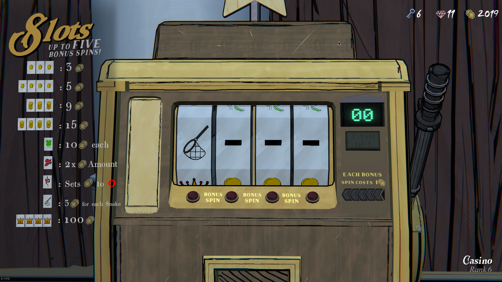

Monte Carlo Tree Search (MCTS) bot to play Blue Prince's one-arm bandit optimally. 

Maximizes gold per cash-out, not gold per hour

Given the simplicity of the game, the MCTS explores at full depth

Automatically determines/refines symbols probabilities while playing



Code is quick and dirty and uses:
- python
- pyautogui for clicks
- mss for screenshots of the game
- numpy, imageio and sklearn for computer vision

Assumptions about the game's mechanics:
- Each symbol draw is independant and follows a uniform sampling

You'll need to understand and patch the the code to use it for yourself. Assumption about the state of the game:
- Playing on the 5 spin machine (the big yellow one that needs to be repaired)
- Blue Prince running on Windows's "main" screen
- 4k screen
- `with mss.mss() as sct: monitor = sct.monitors[2]` gives that monitor
- Graphics settings: brightness 5, resolution 1920x1080 (downscaled)
- Game version: aroudn the 20th june 2025


### Stats

Symbols probabilities (inferred):
- coin 29.9%
- dash 27.7%
- 2x 10.3%
- snake 9.9%
- pile 9.6%
- crown 7.9%
- net 3.8%
- clover 1.0%

Revenues distribution (empirical):
| rank | pattern                        | % of revenue | % of cash outs |
|------|--------------------------------|--------------|----------------|
| #1   | 3-coins + x2                   | 25.5%        | 14.49%         |
| #2   | 3-coins                        | 10.4%        | 11.88%         |
| #3   | 1-clover + x2                  | 10.2%        | 1.74%          |
| #4   | 4-crowns                       | 8.1%         | 0.28%          |
| #5   | 4-coints                       | 6.6%         | 4.50%          |
| #6   | 1-clover + x8                  | 5.5%         | 0.24%          |
| #7   | 3-piles + x2                   | 4.4%         | 0.83%          |
| #8   | 3-coins + 1-clover             | 4.2%         | 1.11%          |
| #9   | 1-clover + x4                  | 4.2%         | 0.36%          |
| #10  | 1-snake-caught                 | 3.5%         | 3.99%          |
| #11  | 1-clover                       | 3.2%         | 1.11%          |
| #12  | 2-snake-caught + x2            | 3.2%         | 0.91%          |
| #13  | 1-snake-caught + x4            | 2.2%         | 0.63%          |
| #14  | 3-piles                        | 1.8%         | 0.67%          |
| #15  | 2-clover                       | 1.4%         | 0.24%          |
| #16  | 1-snake-caught + x2            | 1.0%         | 0.55%          |
| #17  | 2-clover + x4                  | 0.9%         | 0.04%          |
| #18  | 1-clover + 1-snake-caught + x2 | 0.9%         | 0.12%          |
| #19  | 4-piles                        | 0.7%         | 0.16%          |
| #20  | 3-piles + 1-clover             | 0.7%         | 0.12%          |
| #21  | 1-clover + 1-snake-caught      | 0.6%         | 0.16%          |
| #22  | 2-clover + x2                  | 0.5%         | 0.04%          |
| #23  | 3-snake-caught                 | 0.2%         | 0.08%          |
| #24  | 1-clover + 2-snake-caught      | 0.2%         | 0.04%          |
| #25  | 2-snake-caught                 | 0.1%         | 0.04%          |
| #26  | uncaught-snake                 | 0.0%         | 20.88%         |
| #27  | zero                           | 0.0%         | 34.82%         |

Spin rate (empirical): 1.63 spins per cash-out (average)

### Log sample
```
Case 4 - No movements after movements
  0 -> dash
  1 -> dash
  2 -> tref
  3 -> pile
  value: 10
 spin_left=5
  memo_age=13 len(memo)=9227
   {'reroll': 10, 0: 11.99567737869177, 1: 11.995742733140007, 2: -0.8264405333027008, 3: 11.689776012539035}
  next_best_action=1 down_value=11.995742733140007
Case 2 - There's movement
Case 2 - There's movement
Case 2 - There's movement
Case 2 - There's movement
Case 2 - There's movement
Case 4 - No movements after movements
  0 -> dash
  1 -> snak
  2 -> tref
  3 -> pile
  value: 0
 spin_left=4
  memo_age=14 len(memo)=9650
   {'reroll': 0, 0: 11.231939523204407, 1: 11.121080209648161, 2: -0.7390452965300998, 3: 11.020887262812256}
  next_best_action=0 down_value=11.231939523204407
Case 2 - There's movement
Case 2 - There's movement
Case 2 - There's movement
Case 4 - No movements after movements
  0 -> coin
  1 -> snak
  2 -> tref
  3 -> pile
  value: 0
 spin_left=3
  memo_age=15 len(memo)=9650
   {'reroll': 0, 0: 10.428185611061046, 1: 10.751522321530665, 2: -0.7309373187554904, 3: 10.659233010806254}
  next_best_action=1 down_value=10.751522321530665
Case 2 - There's movement
Case 2 - There's movement
Case 2 - There's movement
Case 2 - There's movement
Case 2 - There's movement
Case 4 - No movements after movements
  0 -> coin
  1 -> net-
  2 -> tref
  3 -> pile
  value: 10
 spin_left=2
  memo_age=16 len(memo)=9650
   {'reroll': 10, 0: 11.036222331786018, 1: 10.068279048263134, 2: -0.4808699262255082, 3: 11.036222331786018}
  next_best_action=0 down_value=11.036222331786018
Case 2 - There's movement
Case 2 - There's movement
Case 2 - There's movement
Case 4 - No movements after movements
  0 -> dash
  1 -> net-
  2 -> tref
  3 -> pile
  value: 10
 spin_left=1
  memo_age=17 len(memo)=9650
   {'reroll': 10, 0: 10.424616034944343, 1: 9.135972946315345, 2: -0.6004649852050161, 3: 10.424616034944343}
  next_best_action=0 down_value=10.424616034944343
Case 2 - There's movement
Case 2 - There's movement
Case 2 - There's movement
Case 4 - No movements after movements
  0 -> coin
  1 -> net-
  2 -> tref
  3 -> pile
  value: 10
 spin_left=0
  next_best_action=reroll down_value=10
```